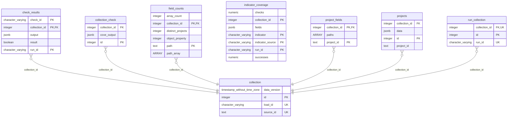

# OC4IDS Database Notebooks

A collection of notebooks for storing and querying OC4IDS data in a database.

Use the buttons below to open notebooks from the default branch:

Notebook | Colab link | Description
-- | -- | --
[Download, Check and Import](https://github.com/open-contracting/oc4ids_database/blob/main/OC4IDS_Database_Data_Import.ipynb) |  | Use this notebook to, download data from OC4IDS publishers, check data using the OC4IDS Data Review Tool and import data and check results into the OC4IDS database.
[Delete Collections](https://github.com/open-contracting/oc4ids_database/blob/main/OC4IDS_Database_Delete_Collections.ipynb) |  | Use this notebook to delete collections from the database.
[Data Feedback](https://github.com/open-contracting/oc4ids_database/blob/main/OC4IDS_Data_Feedback_Notebook.ipynb) |  | Use this notebook to provide feedback on OC4IDS data.
[Indicator Coverage](https://github.com/open-contracting/oc4ids_database/blob/main/OC4IDS_Indicator_Coverage.ipynb) |  | Use this notebook to calculate the coverage of the [OC4IDS Indicators](https://docs.google.com/spreadsheets/d/1Vo6-Jis-J61PB_33QQx1YKnmQnI7M4rTq6CTMckAFsE/edit#gid=882740051).
[CoST IDS Coverage](https://github.com/open-contracting/oc4ids_database/blob/main/OC4IDS_CoST_IDS_Coverage.ipynb) |  | Use this notebook to calculate the coverage of the CoST Infrastructure Data Standard (IDS), according to the [CoST IDS to OC4IDS mapping](https://standard.open-contracting.org/infrastructure/latest/en/cost/#cost-ids-to-oc4ids-mapping).

To open a notebook from a different branch, use Colab's [Github browser](https://colab.research.google.com/github/open-contracting/oc4ids_database/) to choose the notebook and branch you want to open.

Alternatively, you can use the Open in Colab browser extension ([Chrome](https://chrome.google.com/webstore/detail/open-in-colab/), [Firefox](https://addons.mozilla.org/en-US/firefox/addon/open-in-colab/)) to add a button that, when clicked when viewing a Jupyter notebook on github, will open that notebook in Colab.

## Database structure

### ERD diagram

The following diagram shows the relationships between the main tables in the database.

Some tables are omitted from the diagram: those containing reference data used in checks ([`oc4ids_schema`](#oc4ids_schema), [`registered_prefixes`](#registered_prefixes) and [`exchange_rates`](#exchange_rates)) and those used to store temporary data as part of the import process ([`temp_data`](#temp_data) and [`temp_checks`](#temp_checks)).

### Tables

The following table lists all tables in the database. For information on the columns in each table, refer to the subheadings below the table.

| Table                | Description                                                                                                                                                                            |
| ------------------- | -------------------------------------------------------------------------------------------------------------------------------------------------------------------------------------- |
| [collection](#collection)          | A collection is an OC4IDS dataset.                                                                                                                                                     |
| [collection_check](#collection_check)    | libcoveoc4ids CLI output for each collection, i.e. the results reported by the OC4IDS Data Review Tool. For more information, see https://github.com/open-contracting/lib-cove-oc4ids/ |
| [projects](#projects)            | Projects in OC4IDS JSON format.                                                                                                                                                        |
| [field_counts](#field_counts)        | A count of the occurrences of each field in the data.                                                                                                                                  |
| [project_fields](#project_fields)      | The fields present in each project.                                                                                                                                                    |
| [check_results](#check_results)       | Results of running checks on data quality. For more information, see the quality criteria, checks and metrics notebook in https://github.com/open-contracting/notebooks-oc4ids         |
| [run_collection](#run_collection)      | Relationships between collections and check runs.                                                                                                                                      |
| [indicator_coverage](#indicator_coverage)  |                                                                                                                                                                                        |
| [oc4ids_schema](#oc4ids_schema)       | A copy of the OC4IDS schema in 'mapping-sheet' format. For more information, see https://ocdskit.readthedocs.io/en/latest/cli/schema.html#mapping-sheet                                |
| [registered_prefixes](#registered_prefixes) | Registered OC4IDS project prefixes. From https://standard.open-contracting.org/infrastructure/latest/en/reference/prefixes/                                                            |
| [exchange_rates](#exchange_rates)      | USD-base exchange rates for currency conversion.                                                                                                                                       |
| [temp_data](#temp_data)           | A temporary table used when importing data.                                                                                                                                            |
| [temp_checks](#temp_checks)         | A temporary table used for storing the libcoveoc4ids output when importing data.                                                                                                       |

#### collection

| Column       | Type                        | Description                                                                     |
| ------------ | --------------------------- | ------------------------------------------------------------------------------- |
| id           | integer                     | A unique identifier for this collection.                                        |
| source_id    | text                        | A unique identifier for the OC4IDS publisher from which the data was collected. |
| data_version | timestamp without time zone | A timestamp of when the data was imported.                                      |
| load_id      | character varying           | A unique identifer for a group of collections loaded together.                  |

#### collection_check

| Column        | Type    | Description                                                                                                                      |
| ------------- | ------- | -------------------------------------------------------------------------------------------------------------------------------- |
| id            | integer | A unique identifier for this output.                                                                                             |
| collection_id | integer | The collection to which this output relates.                                                                                     |
| cove_output   | jsonb   | The libcoveoc4ids output. Documentation: https://github.com/open-contracting/lib-cove-ocds?tab=readme-ov-file#output-json-format |

#### projects

| Column        | Type    | Description                                     |
| ------------- | ------- | ----------------------------------------------- |
| id            | integer | A unique identifier for this project.           |
| collection_id | integer | The collection to which this project belongs.   |
| project_id    | text    | The `id` of the project from the JSON data.     |
| data          | jsonb   | The OC4IDS JSON data that descibes the project. |

#### field_counts

| Column            | Type    | Description                                                                  |
| ----------------- | ------- | ---------------------------------------------------------------------------- |
| collection_id     | integer | The collection to which this count relates.                                  |
| path              | text    | The JSON Pointer of the field to which this count relates.                   |
| path_array        | text[]  | The components of the JSON Pointer of the field to which this count relates. |
| object_property   | integer |                                                                              |
| array_count       | integer |                                                                              |
| distinct_projects | integer | The number of distinct projects in which the path appears.                   |

#### project_fields

| Column        | Type    | Description                                             |
| ------------- | ------- | ------------------------------------------------------- |
| collection_id | integer | The collection to which the project belongs.            |
| project_id    | text    | The `id` of the project.                                |
| paths         | text[]  | The JSON Pointers of the fields present in the project. |

#### check_results

| Column        | Type              | Description                                                                                                                  |
| ------------- | ----------------- | ---------------------------------------------------------------------------------------------------------------------------- |
| run_id        | character varying | A unique identifier for the run in which this result was calculated.                                                         |
| check_id      | character varying | A unique identifier for the check that this result relates to.                                                               |
| result        | boolean           | The result of the check. TRUE represents success, FALSE represents failure and NULL indicates that no result was calculated. |
| output        | jsonb             | The output of the check.                                                                                                     |
| collection_id | integer           | The id of the collection to which this check result relates.                                                                 |

#### run_collection

| Column        | Type              | Description                            |
| ------------- | ----------------- | -------------------------------------- |
| run_id        | character varying | A run to which the collection belongs. |
| collection_id | integer           | A collection.                          |
| id            | integer           | An identifier for the relationship.    |

#### indicator_coverage

| Column           | Type              | Description |
| ---------------- | ----------------- | ----------- |
| run_id           | character varying |             |
| collection_id    | integer           |             |
| indicator_source | character varying |             |
| indicator        | character varying |             |
| fields           | jsonb             |             |
| successes        | numeric           |             |
| checks           | numeric           |             |

#### oc4ids_schema

| Column           | Type | Description |
| ---------------- | ---- | ----------- |
| section          | text |             |
| path             | text |             |
| title            | text |             |
| description      | text |             |
| type             | text |             |
| range            | text |             |
| values           | text |             |
| links            | text |             |
| deprecated       | text |             |
| deprecationnotes | text |             |

#### registered_prefixes

| Column | Type                  | Description |
| ------ | --------------------- | ----------- |
| prefix | character varying(50) | The prefix. |

#### exchange_rates

| Column   | Type              | Description               |
| -------- | ----------------- | ------------------------- |
| date     | date              | The date of the rate.     |
| currency | character varying | The currency of the rate. |
| rate     | numeric           | The rate.                 |     

#### temp_data

| Column | Type  | Description |
| ------ | ----- | ----------- |
| data   | jsonb |             |

#### temp_checks

| Column      | Type  | Description |
| ----------- | ----- | ----------- |
| cove_output | jsonb |        

## Contributing

### Edit a notebook

#### Make your changes

1. Open the notebook in Colab.

2. Make your changes in Colab, following the [style guide for SQL statements](https://ocp-software-handbook.readthedocs.io/en/latest/python/code.html#sql-statements).

3. Format any SQL code you add or edit using [pgFormatter](http://sqlformat.darold.net/).

#### Commit your changes

1. [Create a branch](https://docs.github.com/en/free-pro-team@latest/github/collaborating-with-issues-and-pull-requests/creating-and-deleting-branches-within-your-repository#creating-a-branch).

In Colab:

2. Click Edit -> Clear all outputs.

3. Remove any database credentials you entered into the notebook.

4. Click File -> Save a copy in Github.

4. Uncheck 'Include a link to Colaboratory'

5. Select your branch, enter a commit message and click OK.

#### Request a review

1. [Create a pull request](https://docs.github.com/en/free-pro-team@latest/github/collaborating-with-issues-and-pull-requests/creating-a-pull-request).

2. Request a review from a helpdesk analyst.

3. If the reviewer requests changes, make the changes then repeat this step.

#### Merge your changes

Once approved, you can merge your changes yourself.

### Edit the database structure

1. Make your changes.
2. Add or update [PostgreSQL comments](https://www.postgresql.org/docs/current/sql-comment.html) on new or changed tables and columns.
3. Update any notebooks affected by your changes.
4. Update the [ERD diagram](#erd-diagram) using [mermerd](https://github.com/KarnerTh/mermerd).
5. Update the [table documentation](#tables), the [`psql`](https://www.postgresql.org/docs/current/app-psql.html) meta-commands `\dt+` (to list tables) and `\d+ table_name` (to list columns).

## Reviewing

### Review changes

[Review the changes](https://docs.github.com/en/free-pro-team@latest/github/collaborating-with-issues-and-pull-requests/reviewing-proposed-changes-in-a-pull-request).

For small changes, you can review the raw diff in the Github review interface.

For larger changes, you can review and comment on a visual diff by clicking the  button. You need to authorize the app the first time you open it.
